# Java 大作业 线上超市购物系统

- PB20111635	
- 蒋磊

***

## 一、题目分析

### 1、开发工具介绍

通过分析，为了实现线上超市购物系统，首先我应该确定需要使用什么工具来构建图形化界面以及存储商品信息，下面是我本次大作业所使用的工具：

- **`IDEA` 开发者工具**：构建项目核心代码，编写 java 类以及各种接口。
- **`scenebuider`**：javafx 的 GUI 构建应用程序，可以通过拖拽等更加简洁有效的方法完成图形化界面的设计。
- **`css`文件**：可以帮助我更加方便地，模块化地自定义 GUI 界面的样式与外观。
- **`mysql`**：非常常用的数据库管理系统，用于存储和管理商品信息，超市职员信息，用户信息，用户购物车信息等。

### 2、核心问题与解决思路

- **区分管理员和用户登录系统**：这里我选择在 IDEA 中创建了两个 `fxml` 文件来分别表示 <u>管理员(超市职员)</u> 和 <u>用户</u> 的登录界面，然后使用 `javafx` 中的 <u>超链接(Hyperlink)</u> 来实现两个登录界面之间的切换。
- **图形界面设计**：主要采用 `StackPane` 来构建基础场景，然后通过往 `StackPane` 中添加 `AnchorPane` 来实现用户端和管理员端里面的各种功能，比如可以在用户端的 `StackPane` 中加入两个 `AnchorPane`，其中一个表示商品界面，另一个表示购物车，详细设计我将在后文中展示。
- **商品的增删改查操作**：主要通过将 `IDEA` 链接到 `mysql` 数据库来实现，通过执行 `mysql` 命令来操作数据库中的 `table`，然后将 table 在图形化界面中展示出来，即可实现对商品信息的增删改查的功能。
- **区分管理员和用户的权限**：在用户界面和管理员界面设置了不同的按钮已实现不同的操作，比如管理员可以增加商品（进货），删除商品（下架）以及修改商品信息等功能，同时管理员界面还可以新建员工信息以实现（引入新员工的功能），同时管理员界面还应该具有一个查看当天以及总收入的界面，详细设计我将在后文中展示。
- **购物车功能与直接购买**：用户可以在商品界面选中商品以及选择数量直接进行购买，或者将商品加入购物车，那么需要为用户单独创建一个数据库 `table`，用来存放用户的购物车中的商品信息，用户还应该能够在购物车界面删除某个商品以及修改要购买的数量等功能，详细设计我将在后文中展示。
- **所有商品属于商品类**：单独创建一个 `java`类，成员变量包括商品名称、商品类别、库存数量、生产日期、保质期、单价等属性，同时编写对应的 `get`和 `set`方法，为管理员操作提供相应的接口。

***

## 二、设计实现

### 1、**用户界面与管理员界面的图形化设计**

首先我创建了两个 `fxml` 文件，用来分别表示用户界面和管理员界面的设计，还有一个 `fxml`文件表示登录界面的设计：

接下来，我在 scenebuider 中打开进行了界面设计，并编写了对应的 css 文件对界面进行美化：

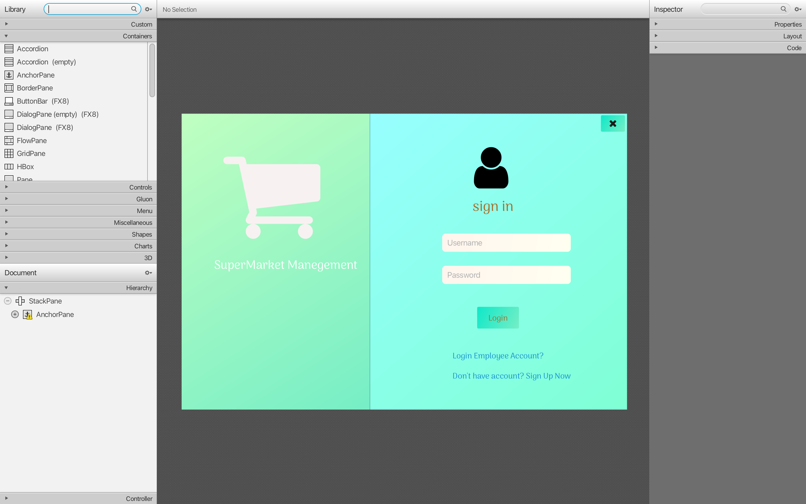

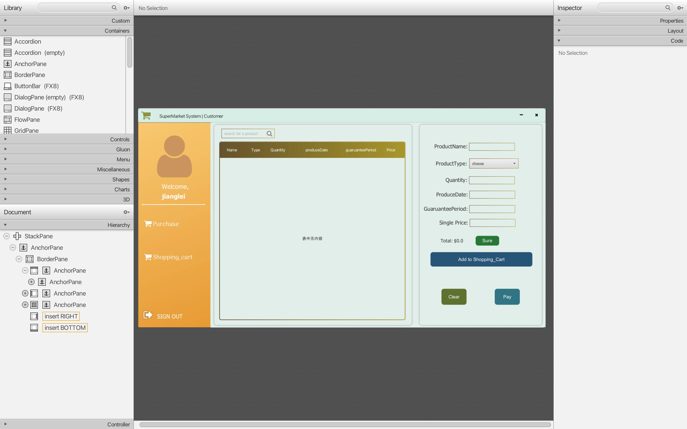

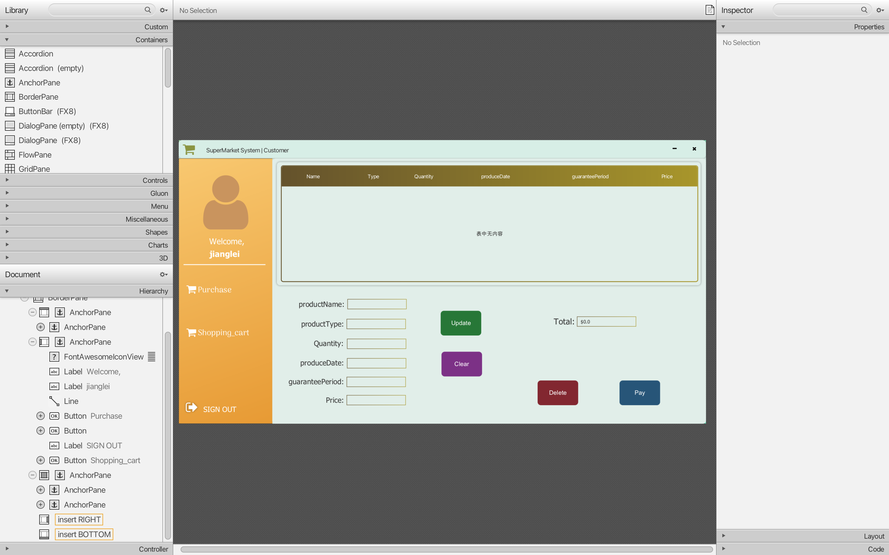

上下三张图分别表示登录界面、用户界面的商品信息界面、购物车界面，我为它们编写了 `switchform`函数进行购物车与商品界面间的切换（源代码我会通过压缩包的形式发送，所有不在报告中展示了）通过设置不同 `Pane`的 `visible`属性即可实现界面切换的功能。

同时我编写了 `setCustomer_login()`和 `setEmployee_login()`两个函数来实现登录界面到用户界面的切换以及登录界面到员工界面的切换，登录的原理是检测数据库中是否有这样的账号密码，如果有就登陆成功，没有就登陆失败，同时我编写了登陆成功与失败的提示信息，下面我将展示一下登录界面：

### **2、管理员端的功能介绍**

#### （1）管理员可以添加商品（进货）

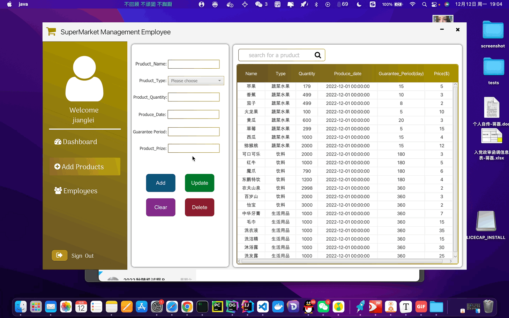

#### （2）管理员可以修改商品的信息（比如商品涨价降价）

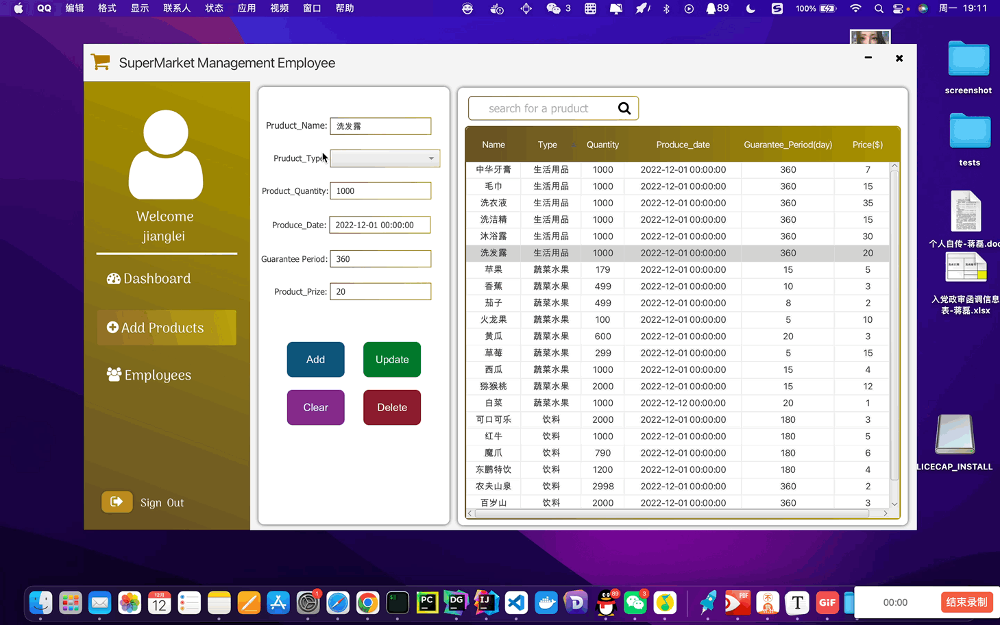

#### （3）管理员可以删除某一个商品（下架商品）

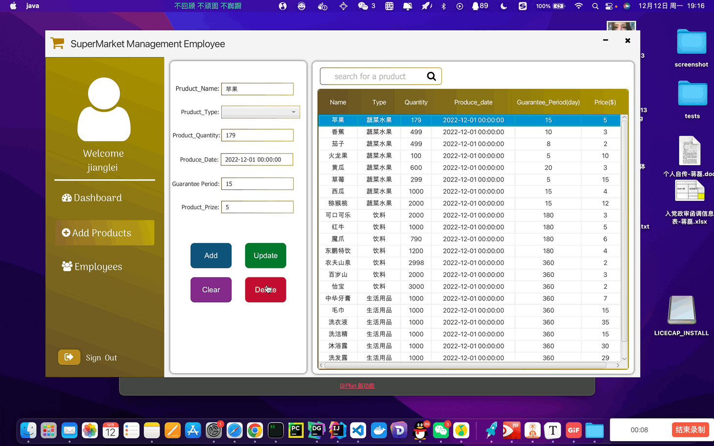

#### （4）管理员可以搜索某一个商品（查找）

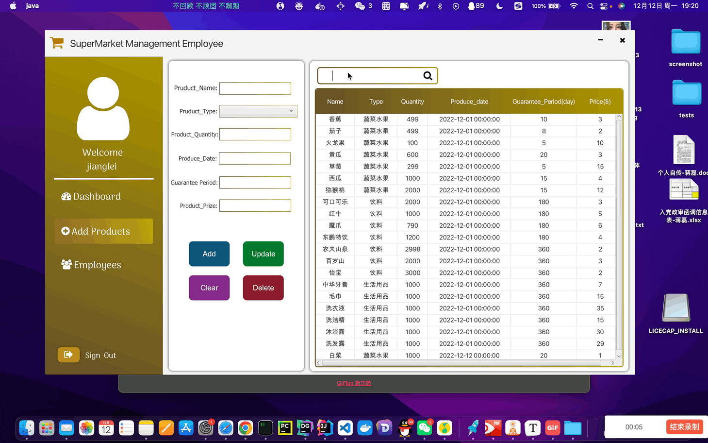

#### （5）管理员可以查看当日收入、总收入、现有员工数量、并且修改员工信息（增加新员工与解雇老员工）

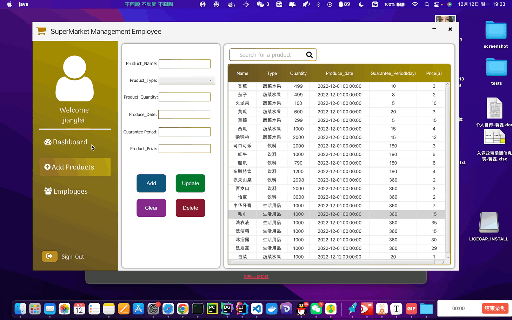

### 3、用户端的功能介绍

#### （1）用户可以对商品进行搜索

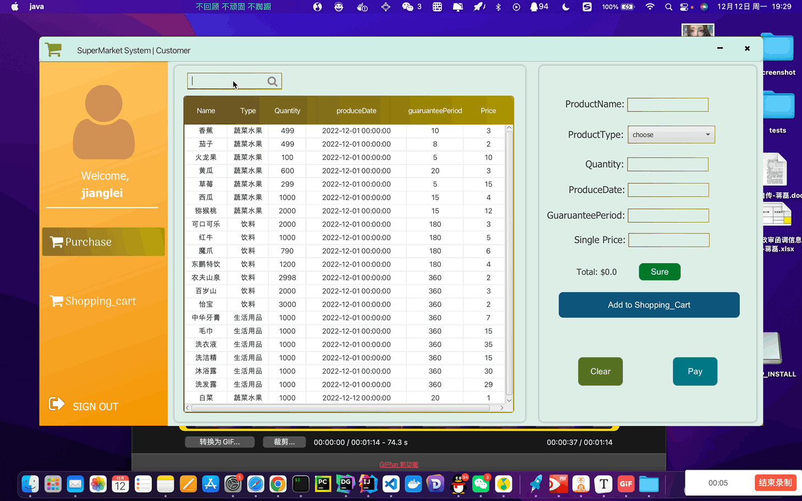

#### （2）用户可以直接在商品信息界面购买商品

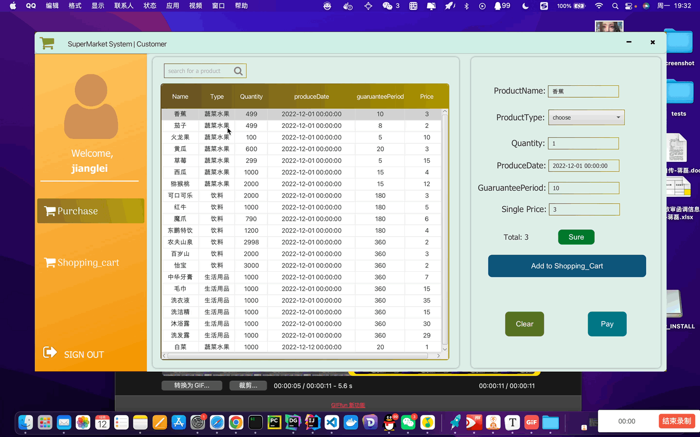

#### （3）用户可以把商品加入购物车后进行购买（清空购物车）

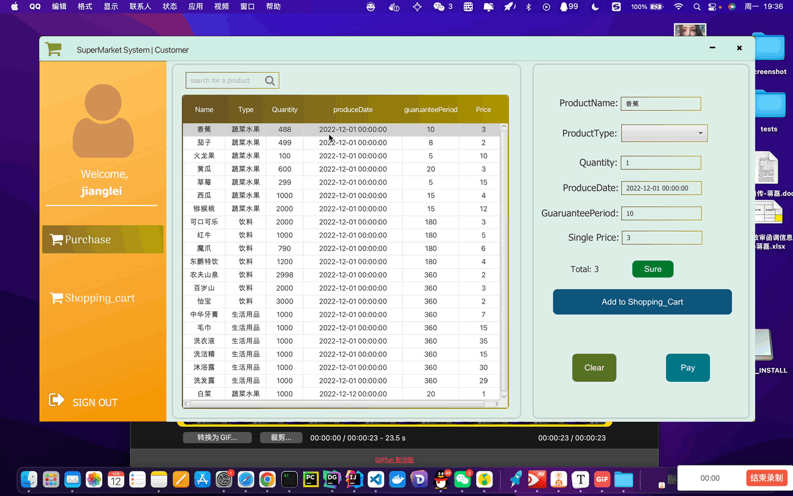

#### （4）用户可以在购物车界面修改商品数量、将商品移出购物车

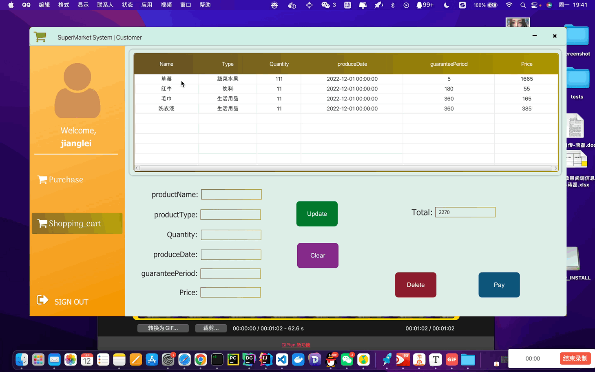

### 4、一些细节功能

#### （1）可以通过按钮最小化界面、关闭界面

#### （2）用户和管理员可以登出系统（log out），并回到登录界面

#### （3）用户和管理员可以通过拖动改变窗口位置

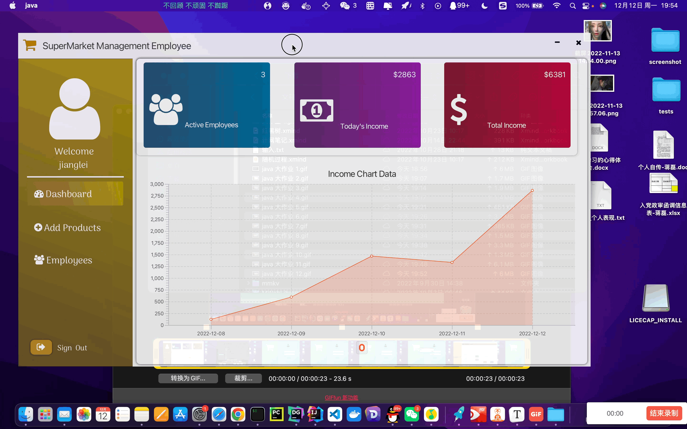

## 三、个人总结

通过本次 java 大作业，我编写了很多类的接口与 javafx 中的控制函数，对面向对象编程有了更加深入的理解，同时，由于本次代码量比较大，一些觉得简单的功能其实也需要严谨的逻辑，实验过程中出现了很多细小的 bug，需要非常耐心地 debug 并进行测试，并且，对于图形界面的设计也花费了很多时间。为了完成作业，还额外学习了很多课外知识，比如学习了 mysql 数据库语句对数据库进行操作，maven 配置依赖库导入 jar 包，css 语句的语法，很多新知识不能快速上手，需要大量地实践操作，虽然本次大作业实现的超市购物系统看上去还不够美观，功能还不够丰富，与实际的购物软件 app 还有不小的差距，但还算是五脏俱全，一个人开发一个软件的工作量确实是非常大的。总之，通过本学期 java 软件开发课程的学习，真的是收获满满，老师上课严谨认真，知识覆盖全面，让我了解到了面向对象编程的精髓，同时也感谢助教老师耐心地批改作业，谢谢你们~